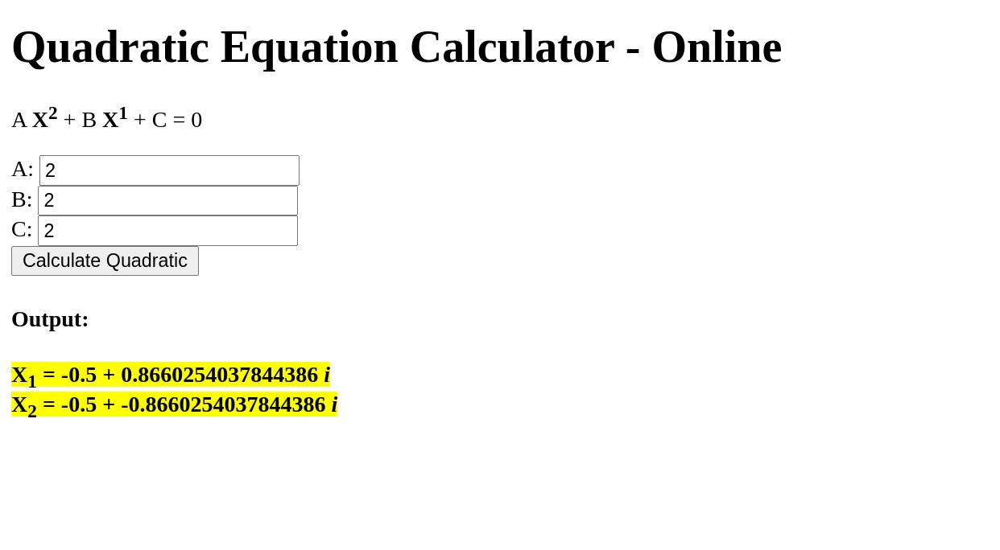

# Quadratic Equation Calculator (Quadratic Solver)

> Solves the linear equation `Ax^2 + Bx + C = 0` for **x**.

I searched about "Quadratic Equation" topic and used exists source and code to implement this web page to calculate roots of **Quadratic Equation** with supporting **Complex Number**.

## Features

- Fast
- Pure JS
- Supporting **Complex number** to finding roots
- Tiny and without needing any third-party tools

    A <b>X2</b>
    +
    B <b>X1</b>
    +
    C
    =
    0

**Demo:** https://basemax.github.io/QuadraticEquationCalculator/quadratic.html
